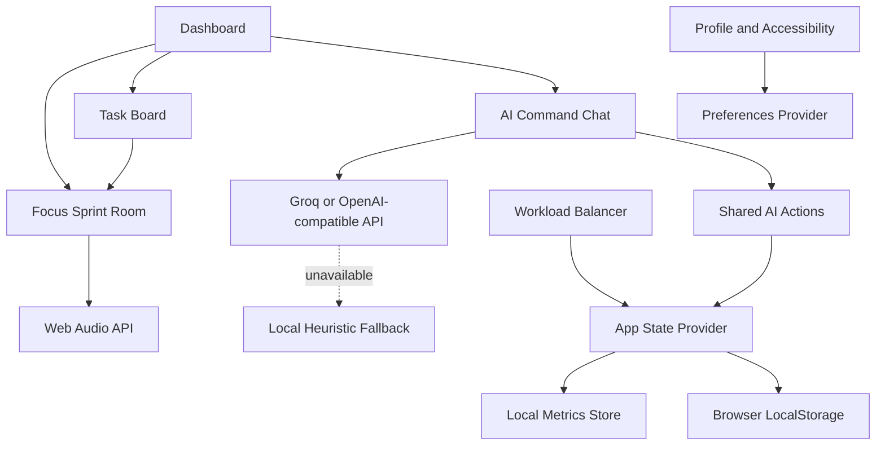

# 🩵 Balance Buddy AI

> **Autonomous workload balancing and burnout defense for university students**

**Team:** DUBISGUTGENUG
**Members:** Gavenesh | Dhaneesh | Kirtanan
**Hackathon track:** Lifestyle Track - Beating the Burnout

[](https://www.canva.com/design/DAHUJpuvOmw/81yK8mFGs1uWb3qc5GKXLQ/edit)

[](https://balance-buddy-ai-03.vercel.app)

## Table of Contents

1. [Overview](#overview)
2. [Problem Statement](#problem-statement)
3. [Market Validation](#market-validation)
4. [Solution](#solution)
5. [Ideation Process and Idea Evolution](#ideation-process-and-idea-evolution)
6. [Mentor Consultations](#mentor-consultations)
7. [Core Features](#core-features)
8. [Application Flow and Architecture](#application-flow-and-architecture)
9. [Neurodiverse UX Accessibility](#neurodiverse-ux-accessibility)
10. [Design Direction](#design-direction)
11. [Tech Stack](#tech-stack)
12. [Privacy and Data Handling](#privacy-and-data-handling)
13. [Project Structure](#project-structure)
14. [Local Setup](#local-setup)
15. [Current Scope and Limitations](#current-scope-and-limitations)
16. [Future Roadmap](#future-roadmap)
17. [Design Links and Presentation](#design-links-and-presentation)

## Overview

Balance Buddy AI is a capacity-aware student productivity platform. Instead of treating productivity as a list of deadlines, it monitors five workload vectors and helps students decide what they can realistically handle:

- Mental
- Time
- Physical
- Social
- Errands

The app combines conversational task entry, autonomous workload rebalancing, recovery lockouts, AI-generated micro-steps, focus sprints, an interactive companion avatar, and ambient soundscapes. Its goal is to intervene before overload becomes burnout.

## Problem Statement

University students carry overlapping academic, social, physical, part-time work, and household responsibilities. Most productivity tools are **task-aware but capacity-blind**: they track what is due, but not whether the student has enough energy, time, or emotional capacity to do it.

This creates three connected problems:

1. **Cumulative overload:** Stress builds across several life areas over time and is difficult to notice early.
2. **Decision fatigue:** Students must repeatedly decide what to postpone, decline, or start when they are already overwhelmed.
3. **Boundary guilt:** Students often accept extra commitments because saying no feels socially difficult, even when their workload is unsafe.

The result is a passive productivity loop: the student receives more reminders, but not enough practical help deciding what can move.

## Market Validation

The following findings come from our team survey of tertiary education students in Malaysia:

| Finding | Survey result |
| --- | ---: |
| Students who experience severe workload overload before the week ends without realizing they were running on empty | **74%** |
| Students who experience sudden burnout spikes without an early warning system | **65%** |
| Students who feel guilty declining extra tasks and consequently overcommit | **80%** |

These results support a product that detects capacity pressure early and reduces the number of decisions a student has to make during an overloaded week.

## Solution

Balance Buddy AI acts as a supportive workload companion rather than another passive task list. It:

- Converts natural language or speech into structured tasks.
- Estimates the capacity impact of new work.
- Suggests deferring lower-priority tasks when load is high.
- Drafts polite decline messages that the student can edit before using.
- Locks task creation during a short recovery window when capacity is critical.
- Breaks large assignments into small, actionable steps.
- Provides a guided focus room with timers, recovery tools, and soundscapes.

## Ideation Process and Idea Evolution

Our product evolved through a series of design and implementation pivots:

```text
[ Phase 1: Manual forms and energy sliders ]
                         |
             Mentor feedback and user friction
                         v
[ Phase 2: Conversational task and capacity entry ]
                         |
          Need for intervention, not passive warnings
                         v
[ Phase 3: Autonomous rebalancing and recovery lock ]
                         |
       Need for lower stimulation and less task paralysis
                         v
[ Phase 4: Neurodiverse modes and micro-step focus room ]
```

| Product area | Initial concept | Friction discovered | Evolution |
| --- | --- | --- | --- |
| Task and capacity entry | Manual forms and energy sliders | Exhausted students do not want to complete several fields or tune multiple sliders | Conversational AI extracts task details and capacity updates from ordinary messages |
| Workload intervention | Static Pomodoro timers and notifications | Passive warnings can be ignored and leave all decisions to the student | Autonomous deferral suggestions, editable decline drafts, and one-tap approval |
| Recovery | A generic break reminder | A reminder does not prevent the student from immediately adding more work | A timed recovery lock temporarily prevents new task creation |
| Task execution | Large assignments shown as one item | Large tasks can cause paralysis, especially in ADHD workflows | AI-generated 10-to-20-minute micro-steps and a two-minute starter option |
| User experience | Dense dashboard with bright visual feedback | Too much motion and contrast can increase executive or sensory overload | Normal, ADHD, and Mild Autism interface modes |
| Motivation | Completion-only feedback | Progress can feel invisible during small steps | Focus Points, streaks, celebration chimes, and companion feedback |

## Mentor Consultations

Mentor feedback shaped the project around one central insight: **a burnout-prevention tool must reduce cognitive load, not create another system to maintain**.

The main consultation outcomes were:

- Replace high-friction form entry with natural conversational input.
- Make the assistant capable of taking useful actions, not only displaying advice.
- Give boundary-setting support through editable decline templates.
- Make recovery an enforceable workflow through a temporary lockout.
- Design explicit accessibility modes instead of expecting one visual style to work for everyone.
- Keep an offline heuristic fallback so a demo or user is not blocked by an unavailable AI service.

## Core Features

### 1. Conversational AI Command Center

- Type natural requests such as adding an assignment or balancing a day.
- Use browser speech recognition where supported.
- Extract task title, course, deadline, hours, and category.
- Update the shared task board and capacity state automatically.
- Trigger `ADD_TASK`, `REBALANCE`, `TRIGGER_RECOVERY`, and `UPDATE_GAUGE` actions.
- Use a local heuristic parser if no AI key is configured or the remote request fails.

### 2. Five-Vector Capacity Engine

The app tracks Mental, Time, Physical, Social, and Errands load. The overall score prioritizes mental and time strain:

$$
capacity = 0.35M + 0.35T + 0.12S + 0.10P + 0.08E
$$

The score is clamped to a range of 0 to 100 and drives status labels, mascot mood, intervention behavior, and recovery protection.

### 3. Autonomous Workload Balancer

- Shows deferred and offloaded tasks with suggested dates.
- Provides an editable decline-message template.
- Lets the student approve the proposed rebalance in one action.
- Supports undoing individual deferrals.
- Activates intervention messaging at high capacity.

### 4. Capacity-Aware Task Board

- Displays urgent and high-impact tasks.
- Separates active work from AI-offloaded work.
- Filters by all tasks, academic work, errands, or deferred tasks.
- Shows estimated duration and workload weight.
- Calculates projected capacity impact while creating a task.
- Allows a task to be clocked into the focus sprint room.
- Prevents new task creation during an active recovery lock.

### 5. Focus Sprint and Recovery Room

- Offers 10-minute, 15-minute, and task-specific sprint durations.
- Supports pause, resume, and reset controls.
- Uses AI to deconstruct an assignment into gentle micro-steps.
- Lets users add custom steps and mark progress.
- Can downsize a step into a two-minute starter action.
- Awards Focus Points for completed steps.
- Includes guided box breathing with inhale, hold, exhale, and rest phases.
- Shows a body-doubling companion message while the timer runs.

### 6. Symbiotic Companion Avatar

The avatar acts as a visual stress mirror. Its mood and coaching copy respond to the current capacity level, including calmer, focused, heavy-load, and recovery-oriented states. It is shown on the dashboard, in chat, and in the sprint room.

### 7. Ambient Soundscapes

The focus room generates sound in the browser with the Web Audio API. Available options include:

- Brown noise
- Rain-like pink noise
- Binaural alpha tones
- Off, mute, and volume control
- Completion chimes for micro-step progress

No external audio files are required for these soundscapes.

### 8. Profile, Preferences, and Insights

- Switch between Normal, ADHD, and Mild Autism modes.
- Toggle light and dark themes.
- View the user profile and current focus points.
- View a seven-day load chart backed by the local metrics store.
- Track a recovery streak.
- Toggle the current calendar-sync preference.

## Application Flow and Architecture



The application uses a shared React context for vectors, tasks, offloaded tasks, recovery state, focus points, and AI actions. Routes are handled by TanStack Router and the UI is organized around reusable glass-card and UI components.

## Neurodiverse UX Accessibility

### ADHD Mode

- Surfaces a single micro-action instead of a large plan.
- Provides high-contrast action triggers.
- Breaks assignments into small steps.
- Uses Focus Points and streak feedback to make progress visible.
- Offers a two-minute starter when a step feels blocked.

### Mild Autism Mode

- Uses a quieter visual presentation.
- Reduces companion animation while the user works.
- Keeps navigation and labels predictable.
- Uses structured sections and explicit controls.
- Supports calming soundscapes without requiring external media.

### Normal Mode

Provides the standard visual treatment, companion feedback, and ambient motion used by the app.

These modes are product accommodations, not medical treatment or a diagnostic system.

## Design Direction

The interface uses a mobile-first glassmorphic visual language:

- Frosted translucent panels with backdrop blur.
- Cool accent colors with separate warning, danger, and safe states.
- Rounded, touch-friendly controls.
- Compact cards designed for scanning on a phone.
- Light and dark themes.
- Reduced motion and lower-stimulation behavior through the accessibility preferences.

The core navigation currently includes Home, Balance, Chat, and Profile. Tasks and the Sprint Room are reachable from the dashboard and task workflows.

## Tech Stack

| Layer | Technology | Purpose |
| --- | --- | --- |
| Frontend | React 19 | Component-based application UI |
| Build and development | Vite | Fast local development and production builds |
| Styling | Tailwind CSS 4 and custom CSS | Responsive layout, themes, glassmorphism, and mode styling |
| Routing | TanStack Router | File-based route definitions and navigation |
| Server functions | TanStack React Start | Server-side handlers for AI requests |
| Icons | Lucide React | Accessible interface iconography |
| AI inference | Groq or OpenAI-compatible chat completions | Conversational task parsing and task deconstruction |
| AI resilience | Local heuristic parser and generated fallback steps | Keeps core demos usable without an API key |
| Voice input | Web Speech API | Optional hands-free task entry |
| Audio | Web Audio API | Client-side soundscape and completion audio generation |
| Charts | Recharts | Available charting support for application insights |
| Persistence | Browser LocalStorage | Local tasks, preferences, vectors, and focus state |
| Language | TypeScript | Typed application logic and component contracts |

## Privacy and Data Handling

The current implementation stores app state in the browser using LocalStorage, including tasks, capacity vectors, preferences, theme, and the active focus task. The local fallback can process supported commands without sending them to an external provider.

When a `GROQ_API_KEY` or `OPENAI_API_KEY` is configured, chat and task-deconstruction requests are sent to the configured OpenAI-compatible endpoint. Users should avoid entering sensitive personal or health information into third-party AI services.

## Project Structure

```text
src/
  components/       Shared shell, avatar, glass cards, modal, and UI primitives
  hooks/            Reusable React hooks
  lib/              App state, preferences, AI, audio, metrics, and utilities
  routes/           Dashboard, tasks, balancer, chat, profile, and sprint screens
  router.tsx        TanStack Router configuration
  server.ts         React Start server entry point
  start.ts          Client entry point
  styles.css        Global theme and application styles
public/             Static assets and model documentation
```

## Local Setup

### Prerequisites

- Node.js 18 or newer
- npm, Bun, or another compatible package manager

### Install and run

```bash
git clone <repository-url>
cd balance-buddy-ai-03
npm install
npm run dev
```

Open the local URL printed by Vite.

### Optional AI configuration

Create a local `.env` file if you want to use a remote OpenAI-compatible provider:

```env
GROQ_API_KEY=your-key
GROQ_MODEL=openai/gpt-oss-120b
GROQ_BASE_URL=https://api.groq.com/openai/v1
```

The app still supports local fallback behavior without these variables.

### Available scripts

```bash
npm run dev          # Start the Vite development server
npm run build        # Create a production build
npm run build:dev    # Create a development-mode build
npm run preview      # Preview the production build
npm run lint         # Run ESLint
npm run format       # Format the repository with Prettier
```

## Current Scope and Limitations

- Calendar sync is currently represented by a local preference toggle; a live Google Calendar API integration is not implemented yet.
- The check-in modal and some baseline/context state exist in the codebase but are not fully exposed as a primary workflow.
- The dashboard task offloader is a separate localStorage-backed component from the main shared task board and may not always represent the same task collection.
- The 3D mascot canvas is present as an implementation option, while the active user flow currently uses the Symbiotic Avatar component.
- Browser voice input depends on Web Speech API support and user microphone permissions.
- Focus soundscapes require a browser that supports Web Audio API and may require a user gesture before audio starts.
- The product is a wellness and workload support tool, not medical advice, therapy, or a burnout diagnosis.

## Future Roadmap

### Year 0: Hackathon and pre-launch

- Stabilize the MVP engine.
- Pilot with approximately 200 students.
- Validate capacity threshold calibration.
- Test ADHD and Mild Autism mode usability.
- Unify the dashboard offloader and main task board state.

### Year 1: Product solidification

- Release iOS and Android versions through Capacitor.js.
- Add two-way Canvas, Blackboard, and Google Calendar integrations.
- Expand campus outreach across Malaysian universities, including UTM, UiTM, and Taylor's.
- Add authenticated profiles and encrypted cloud backup as an opt-in feature.

### Years 2-3: Campus wellness growth

- Build a B2B Campus Wellness Edition.
- Provide anonymized, aggregated burnout trend analytics to participating counseling centers.
- Add institution-level privacy controls and consent management.

### Years 4-5: Wider ecosystem

- Explore wearable integrations such as Apple Watch and Garmin HRV data for the Physical Capacity vector.
- Offer corporate graduate onboarding and transition-support licensing.
- Develop longitudinal, user-controlled wellbeing insights without exposing individual student data.

## Design Links and Presentation

- **Presentation deck:** [Balance Buddy AI on Canva](https://www.canva.com/design/DAHUJpuvOmw/81yK8mFGs1uWb3qc5GKXLQ/edit)
- **Product concept:** Symbiotic AI stress-mirror companion for student workload protection
- **Repository:** This project
- **Deployed link:** [Balance Buddy AI on Vercel](https://balance-buddy-ai-03.vercel.app)

## Team

**DUBISGUTGENUG**
Gavenesh | Dhaneesh | Kirtanan
